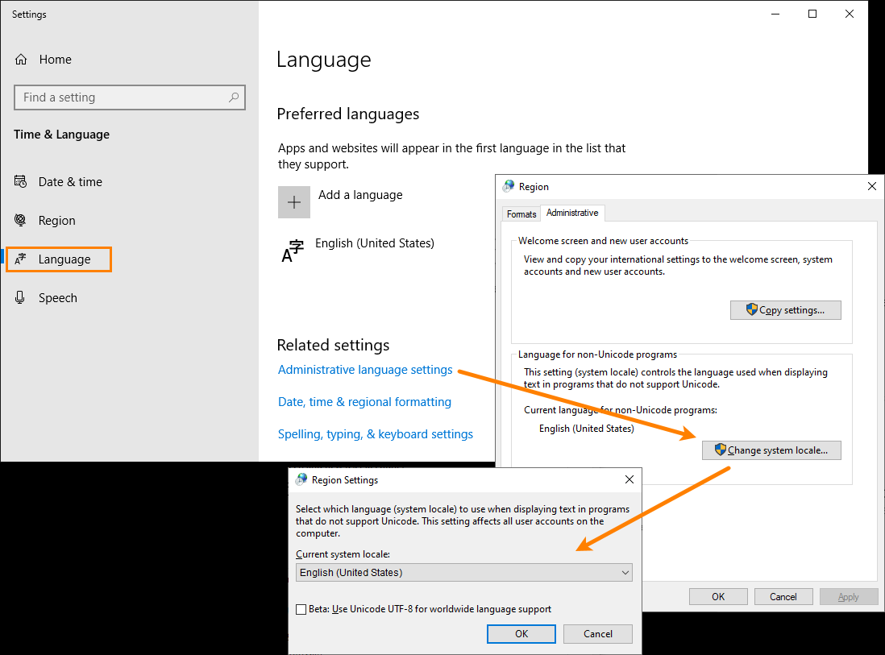
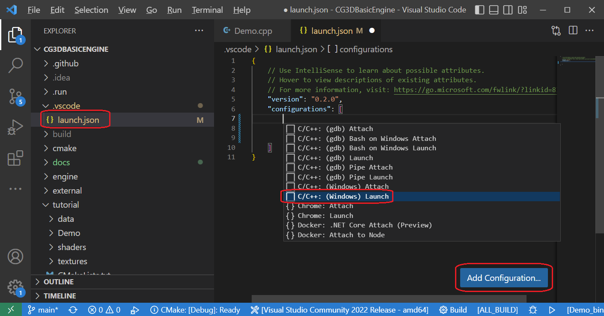
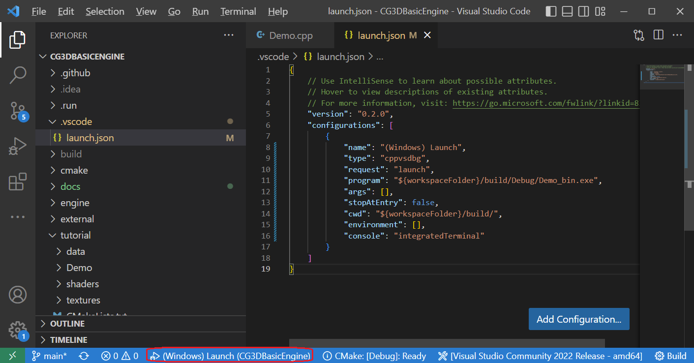
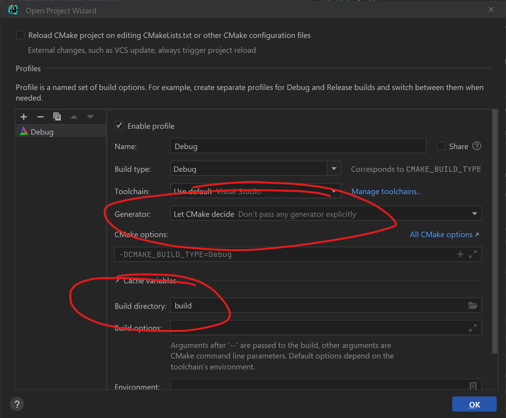
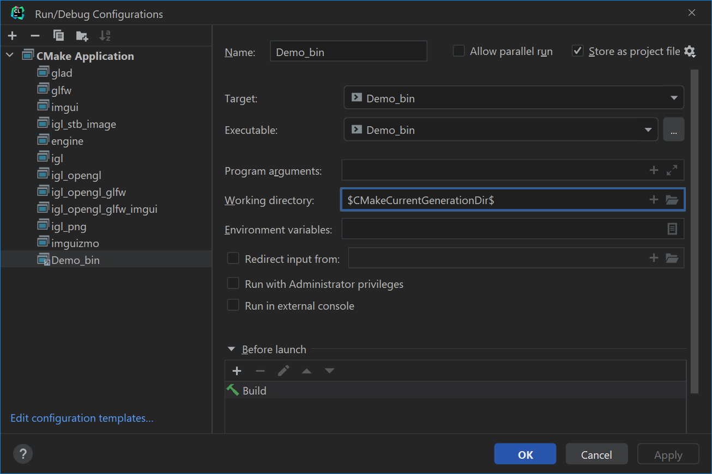

# EngineForAnimationCourse

### Graphic Engine based on Libigl


#### First: clone or download the project from GitHub


### Building / Debugging with CMake + Visual Studio on <u>Windows</u>

1. Download Cmake from the link in the site
2. Run Cmake GUI, choose the project folder and destination folder for the cpp project files, press configure choose compiler (VS2022 for example). After configuration finished successfully press configure again and then press generate. 
3. If everything passes successfully click the "launch project" button or go to the build folder and launch the project from there. 
4. Build and start debugging.


### Building / Debugging with Visual Studio Code on <u>Windows</u>

> Note: some of the notes below about debugging are probably also relevant for **Linux / macOS** (with some adjustments) but I haven't tested it.


#### CMake Tools extension

If when scanning for kits (compilers) the CMake Tools extension doesn't find anything (even though you have it installed), check if changing the system locale to "**English (United States)**" - locale "Israel (Hebrew)" doesn't work (other locales probably work but I only tested "English (United States)". Afterwards **restart the computer** and **scan for kits** again.

This is how you do it:




#### Building / Debugging

1. Make sure you choose the **Debug** build variant:


2. Build and click **(Windows) Launch** to start debugging


#### Updating the Launch Configuration

If the launch configuration is not set up correctly try the following:

1. In VS Code, open *.vscode/launch.json*
2. Click the button **Add Configuration...**
3. Choose **C/C++: (Windows) Launch**



4. Change **program** and **cwd** to the correct paths (I also changed **console** but it's not mandatory).


Here's a configuration that works for me :

```json
{
    "name": "(Windows) Launch",
    "type": "cppvsdbg",
    "request": "launch",
    "program": "${workspaceFolder}/build/Debug/Demo_bin.exe",
    "args": [],
    "stopAtEntry": false,
    "cwd": "${workspaceFolder}/build/",
    "environment": [],
    "console": "integratedTerminal"
}
```


5. Click **(Windows) Launch** to start debugging




### Building / debugging with CLion


When you first open the project you will see the following (or a similar) screen



1. **Do not use the default (Ninja) generator!**

   On Windows choose: "Let CMake decide"

   On Linux/Mac choose "Unix Makefiles"


2. To share the build directory with VS choose build directory to be "build"


Afterwards, open the Demo_bin run configuration and put $CMakeCurrentGenerationDir$ in the working directory.


